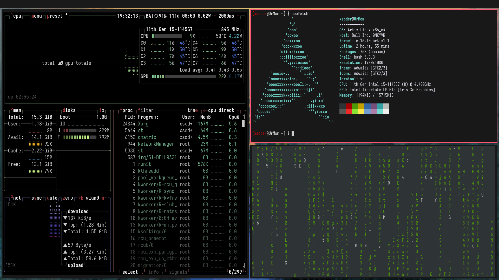

# NWM

- This is supposed to be a hobby project there is not a clear direction
- At the very least a fully working scrollable and standard tiling window manager.



>![WARNING]
> YES WE DO NOT HAVE ANIMATIONS SO FIX UP THE CURRENT COBBLED UP PICOM

- Philosphy is that if dwm had a cleaner code base with no string attached.
- But a little shift which is what if it was scrollable.
- Intention this is a dwm style build does not mean we do ```patch > some.diff ```. No this is a default configuration meant to be daily drivable just some minor changes like font and wallpaper(Which you set yourself not the WM).


## Libraries used

- X11
- Font Related stuff for building u do not need that anymore.
- Basic devel Tools.
- By Default the font is bad install a custom one and change it.

## How to use it

You use it the same way we use dwm compile. load it into your xinitc or desktop session then you are in.

## Todo 

- [ ] Scrolling should be with mouse not keyboard.
- [ ] Addition of cool animations. (Please do this I could care less about them).
- [ ] Bug Fixes like Window resizing with mouse.

Please note that this is just the begining any issue feel free to submit them.
